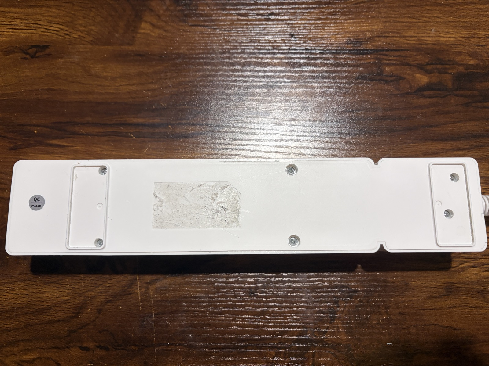
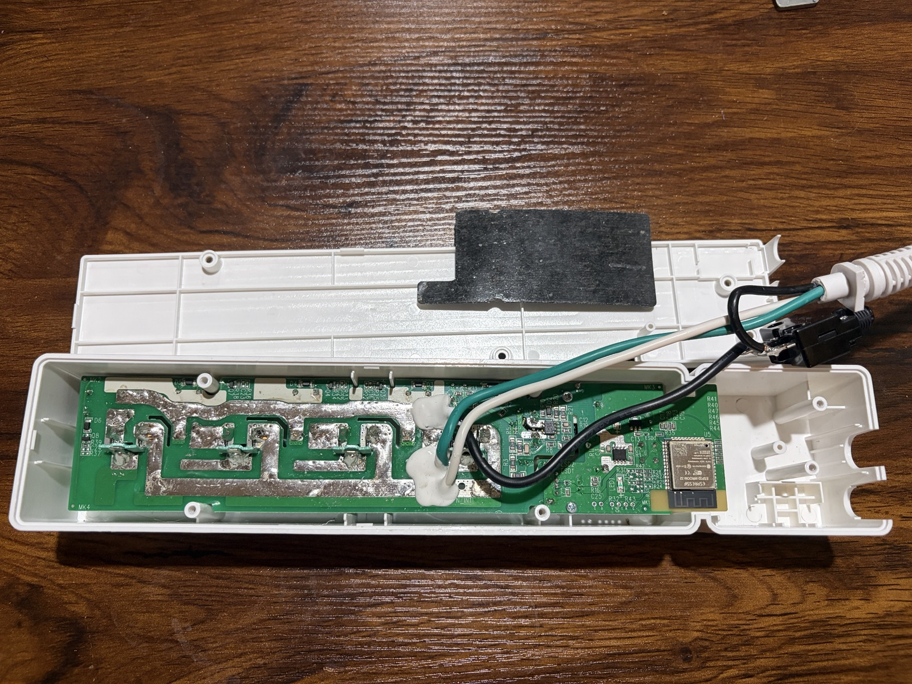
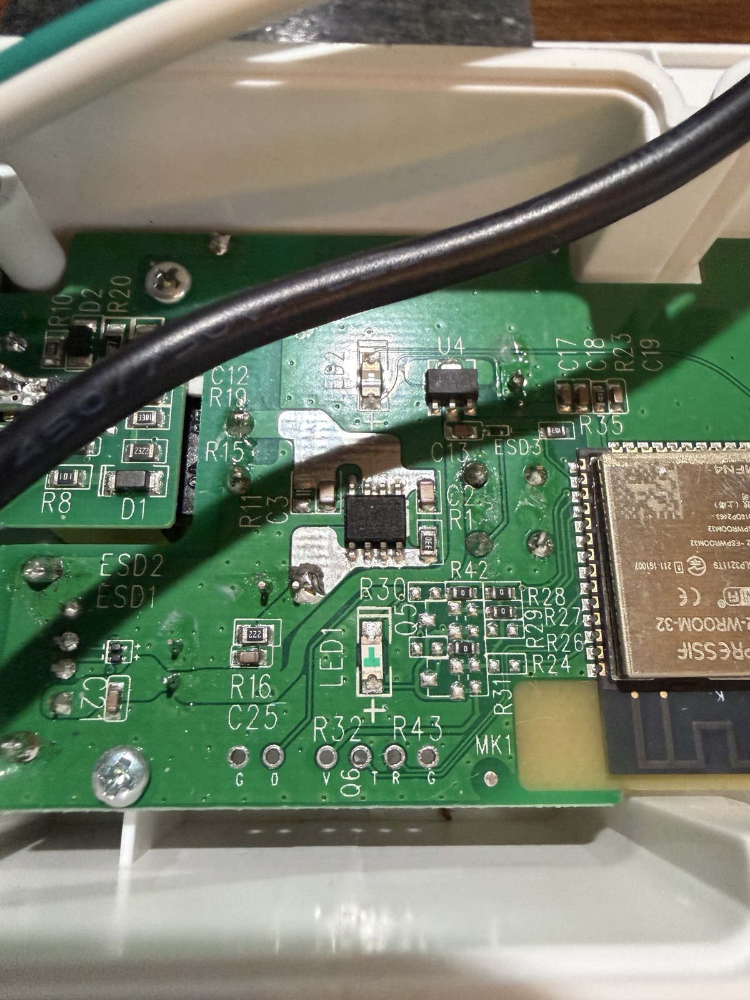
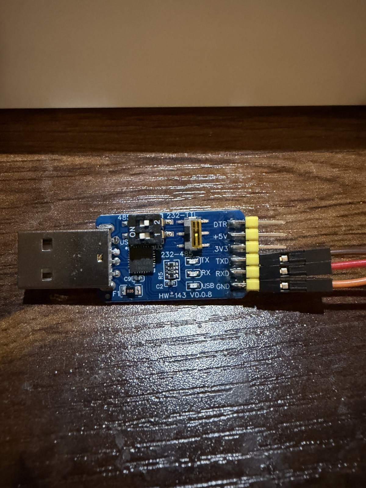
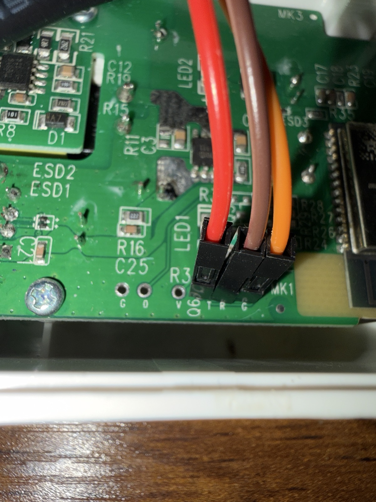
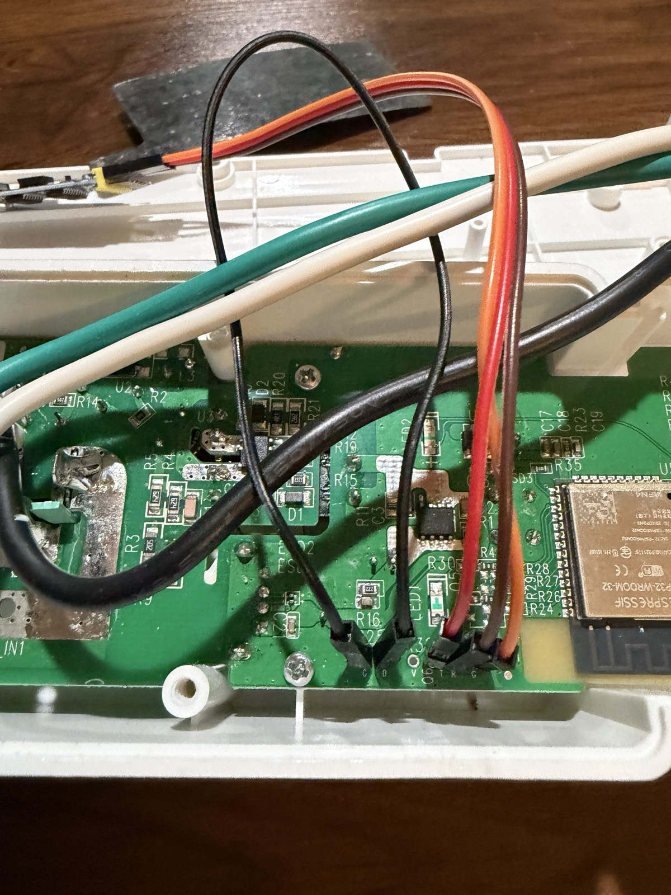

# Install Growhub CE Firmware

This guide is for installing CE firmware on a NIWA Growhub that is still running stock firmware.

First install requires opening the controller and flashing over UART. Later CE-to-CE updates can be done from the web UI.

Growhub CE is provided as-is, without warranty. Opening the controller and flashing third-party firmware can render the device unusable if wiring, power, or flashing steps are wrong. You are responsible for deciding whether to install it and for any damage, data loss, or device failure that may result.

## Before You Start

You need:

- NIWA Growhub controller
- 3.3 V USB-to-TTL adapter, typically CP2102
- jumper wires (3 Male to Female, 1 Male to Male)
- small Phillips screwdriver
- macOS or Linux computer with `python3` (Windows support coming)
- internet access for the first run of the flash script

Safety notes:

- **Unplug the Growhub before opening or wiring it.**
- Do not connect the adapter's `3.3V` or `VCC` pin to the Growhub.
- Power the Growhub from its own power supply.
- This firmware replaces the stock Niwa firmware.
- Follow the labels on your adapter and the Growhub PCB, not wire colors in the photos.

## Download

Download the first-flash ZIP from GitHub Releases:

```text
growhub-ce-first-flash-<version>.zip
```

Unzip it. The folder should contain:

```text
flash-growhub-ce.sh
merged-firmware.bin
SHA256SUMS
README-FIRST-FLASH.txt
```

## Open The Controller

**Unplug the Growhub before opening it.**
Remove the six screws on the bottom of the controller.



Lift the cover carefully. Remove the plastic shield covering the components. The UART pads are on the right side of the main PCB, near the ESP32 module and the `MK1` label.



## Wire The Adapter

The Growhub UART pads are near the `MK1` label.

Left to right:

```text
G O V T R G
```

Close-up of the UART pad row:



1. Wire the USB-to-TTL adapter like this:

| Adapter pin | Growhub pad |
|---|---|
| TXD | R |
| RXD | T |
| GND | G |
| 3.3V / VCC | leave disconnected |

Example USB-to-TTL adapter wiring. Your adapter may use different pin order or labels; use its silk-screen labels.



Example Growhub pad wiring:



2. Bridge `O` to `G`.
3. Plug the UART USB into your computer
4. Plug in/power on the Growhub while `O` and `G` are bridged.
5. Do not remove the bridge wire or UART wires until the flashing is complete.

Ready to flash, with UART connected and `O` bridged to `G`:



## Flash

Open Terminal in the unzipped first-flash folder and run:

```bash
./flash-growhub-ce.sh
```

The script will:

- create a local `.venv`
- install `esptool`
- verify `merged-firmware.bin`
- detect the USB-to-TTL adapter
- wait until the Growhub is in ESP32 download mode
- back up the current 4 MB stock firmware into `stock-backups/`
- flash CE firmware

When the script says flashing is complete:

1. Remove the `O` to `G` bridge and UART wires.
2. Power-cycle the Growhub normally.
3. Wait for CE firmware to boot.

## First Boot

After CE boots, it creates an open WiFi access point named:

```text
growhub_<last4mac>
```

Connect to that network, then open:

```text
http://192.168.4.1
```

Use the web UI to configure WiFi, device name, outlet labels, schedules, and optional MQTT.

## Troubleshooting

If the script cannot find the adapter, unplug and reconnect the USB-to-TTL adapter, then run the script again.

If you have more than one serial adapter connected, verify then force the port:

```bash
PORT=/dev/cu.usbserial-0001 ./flash-growhub-ce.sh
PORT=/dev/ttyUSB0 ./flash-growhub-ce.sh
```

If the script keeps waiting for the bootloader:

- confirm `O` is bridged to `G`
- power-cycle the Growhub while the bridge is held
- close any serial monitor or other app using the USB serial port
- confirm `TXD -> R`, `RXD -> T`, and `GND -> G`

If macOS says the script is not executable:

```bash
chmod +x flash-growhub-ce.sh
./flash-growhub-ce.sh
```

If checksum verification fails, delete the folder and download the ZIP again.

## Stock Firmware Backup

Before writing CE firmware, the script saves the Growhub's current 4 MB flash into:

```text
stock-backups/
```

Keep this file somewhere safe after flashing. It is your rollback copy of the firmware that was on the device before CE was installed.

Do not upload or share stock backup files. A full flash dump may contain device-specific settings.

Advanced users can skip the backup with:

```bash
STOCK_BACKUP=0 ./flash-growhub-ce.sh
```

## Which Firmware File Is Which?

Use `growhub-ce-first-flash-<version>.zip` for first install from stock firmware.

Use `firmware.bin` only for later CE-to-CE web UI or MQTT updates.

Do not use `merged-firmware.bin` for normal web UI OTA updates. It is only for UART first flashing.
